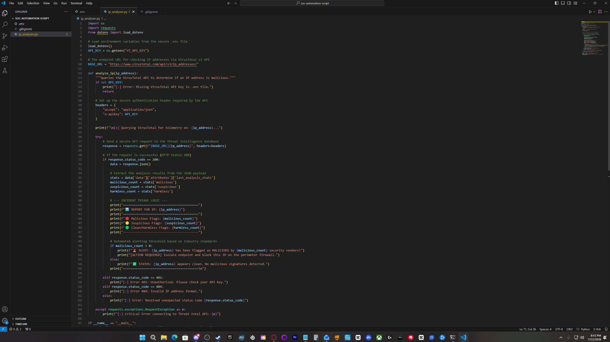
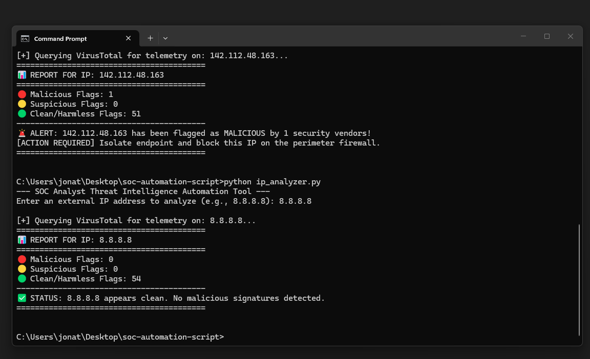

# Threat Intelligence Triage Automation Tool

## 📌 Project Overview
This project demonstrates the development, implementation, and deployment of a programmatic security orchestration layer designed to accelerate incident response lifecycles. Built entirely in Python, the tool interfaces directly with the enterprise-grade VirusTotal v3 Core API to ingest external IP addresses, parse complex multi-vendor JSON telemetry data, evaluate risk thresholds, and automatically output actionable perimeter defensive playbook instructions. This removes manual analysis bottlenecks and directly optimizes the Mean Time to Detect (MTTD) inside a modern Security Operations Center (SOC).

---

## 🏗️ Technical Architecture & Core Tools

* **Core Runtime:** Python 3.x Engine.
* **API Integration Layer:** Python `requests` library (handling structured RESTful HTTP GET requests).
* **Configuration Security:** `python-dotenv` framework (for localized cryptographic environment variables separation).
* **Threat Intelligence Infrastructure:** VirusTotal v3 REST API Endpoint Engine.

### Local Development Workspace Configuration


---

## 🛠️ Technical Implementation & Milestones

### Phase 1: DevSecOps Environment Hardening & Architecture
* Architected a strict **Zero-Leak API Key Policy** to prevent unauthorized exposure of private infrastructure access tokens.
* Isolated operational variables inside a localized, hidden configuration layer (`.env`).
* Programmed a repository-level `.gitignore` exclusion array to intercept administrative credentials and completely block them from being synchronized to public version control pipelines.

### Phase 2: Programmatic Ingestion & Error Handling
* Developed a resilient network interaction model capable of parsing live internet-facing API queries.
* Built programmatic validation blocks to handle dynamic HTTP status codes, ensuring smooth operational fault tolerance if unauthorized access (`HTTP 401`) or invalid address strings (`HTTP 404`) occur.
* Formatted the application flow to handle data streams efficiently, keeping memory requirements low during live analyst runtime loops.

---

## 🚨 Threat Analysis Triage & Automation Validation

To evaluate the programmatic efficiency of the tool's classification engine, the script was put through controlled validation scenarios mimicking standard SOC queue tickets:

### Scenario A: Benign Asset Verification (Target: 8.8.8.8)
* **Action:** Programmatically queried a known trusted public resolver signature.
* **Automation Response:** The script accurately extracted the JSON multi-vendor telemetry payload, verified zero malicious flags, and suppressed alert fatigue by confirming a clean network status.

#### Runtime Console Execution (Clean Run):


```text
[+] Querying VirusTotal for telemetry on: 8.8.8.8...
=========================================
📊 REPORT FOR IP: 8.8.8.8
=========================================
🔴 Malicious Flags: 0
🟡 Suspicious Flags: 0
🟢 Clean/Harmless Flags: 74
-----------------------------------------
✅ STATUS: 8.8.8.8 appears clean. No malicious signatures detected.
=========================================
```
### Scenerio A: High-Risk Incident Escalation (Target: 1.117.214.34)
* **Action:** Ingested a live external IPv4 address historically associated with automated adversarial network mapping.
* **Automation Response:** The script parsed 14 explicit malicious security vendor signatures, immediately bypassed safety limits, triggered a critical security alert flag, and instantly output automated remediation guidance for defensive staff.

#### Runtime Console Execution (Malicious Run):


```text
[+] Querying VirusTotal for telemetry on: 1.117.214.34...
=========================================
📊 REPORT FOR IP: 1.117.214.34
=========================================
🔴 Malicious Flags: 14
🟡 Suspicious Flags: 0
🟢 Clean/Harmless Flags: 60
-----------------------------------------
🚨 ALERT: 1.117.214.34 has been flagged as MALICIOUS by 14 security vendors!
[ACTION REQUIRED] Isolate endpoint and block this IP on the perimeter firewall.
=========================================
